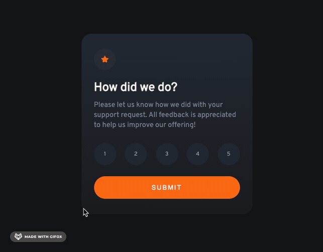

# Frontend Mentor - Interactive rating component

### Screenshot

## Welcome! 👋

Thanks for checking out this front-end coding challenge.

**To do this challenge, you need a basic understanding of HTML, CSS and JavaScript.**

## The challenge

Challenge is to build out this interactive rating component and get it looking as close to the design as possible.

Your users should be able to:

- View the optimal layout for the app depending on their device's screen size
- See hover states for all interactive elements on the page
- Select and submit a number rating
- See the "Thank you" card state after submitting a rating

### Links

- Solution URL: [Solution URL here](https://your-solution-url.com)
- Live Site URL: [Live site here]()

## Author

- Website - [@tonyruizo](https://www.tonyruizo.me)
- Frontend Mentor - [@truizormeno](https://www.frontendmentor.io/profile/truizormeno)
- Twitter - [@tonyruizo](https://www.twitter.com/tonyruizo)
